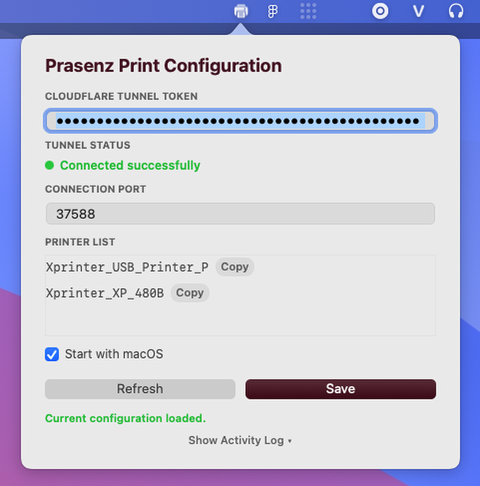

# 🖨️ PrasenzPrinter

A native macOS Menu Bar application that hosts an HTTP server to receive PDF documents and prints them automatically using the local printer queue (via macOS CUPS `lp` commands). It also manages a background Cloudflare Tunnel (`cloudflared`) to allow secure printing from cloud services without requiring a static public IP or port forwarding.

<p align="center">
  
</p>

---

## 🏗️ Architecture

```
                     ┌──────────────────────────────────────┐
                     │          PrasenzPrinter.app          │
                     │      (Native Swift Application)      │
                     └──────────────────┬───────────────────┘
                                         │
              ┌──────────────────────────┼──────────────────────────┐
              ▼                          ▼                          ▼
      [ Status Bar UI ]         [ HTTP TCP Listener ]       [ Subprocess Manager ]
     ├── Menu Bar Icon (🖨️)     ├── Port: 37588 (Default)   └── Manages background
     └── Settings Popover       └── POST /print                  cloudflared tunnel
                                         │
                                         ▼
                               ┌───────────────────┐
                               │ Thread-safe Queue │
                               └─────────┬─────────┘
                                         │
                                         ▼
                                [ macOS CUPS (lp) ]
```

- **Network Framework (`NWListener`)**: Listens on TCP port `37588` (configurable) to accept print jobs. Supports HTTP/1.1 keep-alive so a client can stream a burst of jobs over one connection, with a request body-size cap and an idle-connection timeout.
- **Per-printer Print Queues**: Each printer gets its own serial sub-queue. Jobs to the **same** printer are submitted to CUPS strictly in the order they were received (FIFO), while **different** printers print in parallel. Documents are streamed to `/usr/bin/lp` via stdin (no temp files). A backlog cap protects memory under bursts (returns HTTP `503` when full).
- **Subprocess Management**: Automatically runs and manages the appropriate `cloudflared` binary for the host system's architecture (Intel or Apple Silicon).
- **Persistent Configuration**: Saved locally at `~/.prasenz-printer/settings.json`.
- **Optional Log Forwarding**: When a New Relic license key is set, application logs are batched and shipped to the New Relic Log API.

---

## ⚙️ Requirements

- macOS 10.15 (Catalina) or later.
- Command Line Tools (install via `xcode-select --install`).
- A printer configured and working in macOS System Settings.

---

## 🛠️ Compilation & Packaging

To compile and package the application into a Universal Binary:

```bash
# 1. Clone the repository
git clone <your-repo-url> prasenz-print-client
cd prasenz-print-client

# 2. Compile and package the app
chmod +x scripts/*.sh
./scripts/build.sh
```

The build script will:
1. Download the matching Intel/Apple Silicon Cloudflare Tunnel (`cloudflared`) executables if not present.
2. Compile the Swift source files for both `x86_64` and `arm64` targets.
3. Merge the binaries using `lipo` to produce a Universal Binary.
4. Package the final application to `dist/PrasenzPrinter.app`.

---

## 📦 Installation & Usage

1. Copy the compiled `dist/PrasenzPrinter.app` to your `/Applications` directory.
2. Launch the application.
3. Use the Menu Bar icon **🖨️** to open the settings popover:
   - **Cloudflare Tunnel Token**: Enter your Cloudflare Zero Trust token.
   - **Connection Port**: Set the local port (default: `37588`).
   - **New Relic License Key**: (Optional) Enter a New Relic ingest license key to forward logs.
   - **Printer List**: View available printers and copy target names for API usage.
   - **Start with macOS**: Configure the agent to launch at system startup.

---

## 🔒 Cloudflare Tunnel Setup

1. In the [Cloudflare Zero Trust Portal](https://one.dash.cloudflare.com/), create a new Cloudflare Tunnel.
2. Copy the **Tunnel Token**.
3. Under **Public Hostnames**, route a domain/subdomain of your choice to `http://localhost:37588`.
4. Paste the **Tunnel Token** in the app settings, click **Save**, and restart the tunnel.

---

## 🌐 API Integration

### `POST /print`

Accepts binary PDF data and routes it to the target printer.

#### Headers
- `x-printer-name` (Required): The exact destination printer name (copy from the settings popover).
- `x-print-options` (Optional): Space-separated options passed directly to the macOS `/usr/bin/lp` command. Use this to configure paper size, margins, and scaling.
- `CF-Access-Client-Id` / `CF-Access-Client-Secret` (Optional): For Cloudflare Access gateway authentication.

#### Example Options (`x-print-options`)
- **Paper Size**: `-o media=A4` or `-o media=Letter` or `-o media=custom_80x200mm`
- **Margins**: `-o page-left=0 -o page-right=0 -o page-top=0 -o page-bottom=0` (0 margins)
- **Scaling**: `-o scaling=100` (no scale) or `-o fit-to-page`

#### Responses
- `200 OK` — job accepted and **enqueued** (returned immediately; the actual spool/print happens asynchronously, in received order per printer).
- `400 Bad Request` — missing `x-printer-name` header or empty body.
- `413 Payload Too Large` — body exceeds the server's max request size.
- `503 Service Unavailable` — that printer's backlog is full; retry shortly.

> **Ordering note:** order is guaranteed **per printer** only. To rely on it, send jobs for the same printer sequentially (or over a single keep-alive connection). Jobs to different printers run concurrently.

### Quick Testing with cURL

```bash
# Define parameters
PRINTER_NAME="Your_Printer_Name_Here"
PDF_FILE="/path/to/test_file.pdf"

# Send the print job with A4 paper size, 0 margins, and 100% scale
curl -X POST http://localhost:37588/print \
  -H "Content-Type: application/pdf" \
  -H "x-printer-name: $PRINTER_NAME" \
  -H "x-print-options: -o media=A4 -o scaling=100 -o page-left=0 -o page-right=0 -o page-top=0 -o page-bottom=0" \
  --data-binary @"$PDF_FILE"
```

### Nuxt Backend Handler Example

```typescript
export default defineEventHandler(async (event) => {
  const body = await readBody(event);
  const { printerName, options, pdfBuffer } = body;

  const tunnelUrl = process.env.PRINT_TUNNEL_URL || 'https://print-api.yourdomain.com';
  
  try {
    await $fetch(`${tunnelUrl}/print`, {
      method: 'POST',
      headers: {
        'Content-Type': 'application/pdf',
        'x-printer-name': printerName,
        'x-print-options': options || '-o fit-to-page',
        'CF-Access-Client-Id': process.env.CF_ACCESS_CLIENT_ID || '',
        'CF-Access-Client-Secret': process.env.CF_ACCESS_CLIENT_SECRET || ''
      },
      body: pdfBuffer
    });
    return { success: true };
  } catch (error: any) {
    console.error('[Print Error]:', error.message);
    throw createError({
      statusCode: 500,
      statusMessage: `Printing failed: ${error.message}`
    });
  }
});
```

---

## 📂 Directory Structure

```
/Applications/PrasenzPrinter.app/
└── Contents/
    ├── Info.plist                     # Application package metadata
    └── MacOS/
        ├── PrasenzPrinter             # Universal Swift binary (GUI & HTTP Server)
        └── bin/
            ├── cloudflared-intel      # Cloudflare Tunnel for x86_64 macOS
            └── cloudflared-silicon    # Cloudflare Tunnel for arm64 macOS
```

- **Persistent Configuration**: Saved to `~/.prasenz-printer/settings.json` on the host machine.

---

## 🗑️ Clean Uninstallation

To completely remove the app and its background components:

1. Right-click the Menu Bar icon **🖨️** and choose **Exit**.
2. Run the uninstallation script:
   ```bash
   ./scripts/uninstall.sh
   ```
   *Alternatively, manually delete:*
   - `/Applications/PrasenzPrinter.app`
   - `~/.prasenz-printer/`
   - `~/Library/LaunchAgents/com.prasenz.printagent.plist`
   - `/tmp/prasenz_print_agent.log` and `/tmp/prasenz_print_agent_err.log`

---

## 🔧 Configuration Keys (`~/.prasenz-printer/settings.json`)

| Key | Description |
|-----|-------------|
| `TUNNEL_TOKEN` | Cloudflare Tunnel token. |
| `PORT` | Local HTTP port (default `37588`). |
| `NEW_RELIC_LICENSE_KEY` | New Relic ingest license key. Empty disables log forwarding. |
| `NEW_RELIC_ENDPOINT` | Optional. Defaults to the US Log API (`https://log-api.newrelic.com/log/v1`); set the EU endpoint (`https://log-api.eu.newrelic.com/log/v1`) here if needed. |

> The license key is a secret — restrict access to the file (e.g. `chmod 600 ~/.prasenz-printer/settings.json`).

---

## 🔧 Troubleshooting

### Logs
Since the app runs as a status bar application, logs are written to:
- Standard logs: `tail -f /tmp/prasenz_print_agent.log`
- Error logs: `tail -f /tmp/prasenz_print_agent_err.log`
- New Relic: when `NEW_RELIC_LICENSE_KEY` is set, logs are also forwarded to the New Relic Logs UI (service `PrasenzPrinter`).

---
